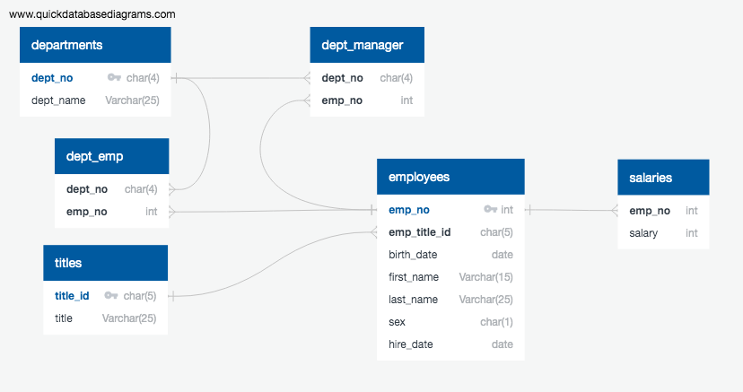

# Employee Database: A Mystery in Two Parts


## Background

It is a beautiful spring day, and it is two weeks since you have been hired as a new data engineer at Pewlett Hackard. Your first major task is a research project on employees of the corporation from the 1980s and 1990s. All that remain of the database of employees from that period are six CSV files.

In this project, I will design the tables to hold data in the CSVs, import the CSVs into a SQL database, and answer questions about the data. In other words, I will perform:

1. Data Engineering

3. Data Analysis


## Data Modeling

Inspected the CSVs and sketched out an ERD of the tables using the tool [http://www.quickdatabasediagrams.com](http://www.quickdatabasediagrams.com).



## Data Engineering

* Using the information created a table schema for each of the six CSV files. Specified data types, primary keys, foreign keys, and other constraints.
* Created tables in the following order: titles, employees, departments, dept_manager, dept_emp and salaries to handle foreign keys.
* Imported each CSV file into the corresponding SQL table. Imported the data in the same order that the tables were created and accounted for the headers when importing to avoid errors.

## Data Analysis

Once the Data Engineering was complete and the entire database was available in PostgreSQL, queried the data as follows:

1. List the following details of each employee: employee number, last name, first name, sex, and salary.


2. List first name, last name, and hire date for employees who were hired in 1986.


3. List the manager of each department with the following information: department number, department name, the manager's employee number, last name, first name.


4. List the department of each employee with the following information: employee number, last name, first name, and department name.


5. List first name, last name, and sex for employees whose first name is "Hercules" and last names begin with "B."


6. List all employees in the Sales department, including their employee number, last name, first name, and department name.


7. List all employees in the Sales and Development departments, including their employee number, last name, first name, and department name.


8. In descending order, list the frequency count of employee last names, i.e., how many employees share each last name.


## Bonus Analysis

As you examine the data, you are overcome with a creeping suspicion that the dataset is fake. You surmise that your boss handed you spurious data in order to test the data engineering skills of a new employee. To confirm your hunch, you decide to take the following steps to generate a visualization of the data, with which you will confront your boss:

1. Import the SQL database into Pandas. (Yes, you could read the CSVs directly in Pandas, but you are, after all, trying to prove your technical mettle.) This step may require some research. Feel free to use the code below to get started. Be sure to make any necessary modifications for your username, password, host, port, and database name:

   ```sql
   from sqlalchemy import create_engine
   engine = create_engine('postgresql://localhost:5432/<your_db_name>')
   connection = engine.connect()
   ```

* Consult [SQLAlchemy documentation](https://docs.sqlalchemy.org/en/latest/core/engines.html#postgresql) for more information.

* If using a password, do not upload your password to your GitHub repository. See [https://www.youtube.com/watch?v=2uaTPmNvH0I](https://www.youtube.com/watch?v=2uaTPmNvH0I) and [https://help.github.com/en/github/using-git/ignoring-files](https://help.github.com/en/github/using-git/ignoring-files) for more information.

2. Create a histogram to visualize the most common salary ranges for employees.

3. Create a bar chart of average salary by title.

## Epilogue

Evidence in hand, you march into your boss's office and present the visualization. With a sly grin, your boss thanks you for your work. On your way out of the office, you hear the words, "Search your ID number." You look down at your badge to see that your employee ID number is 499942.
